# Build the popular ‘Hot Dog’ or ‘Not Hot Dog’ app in 30 mins using Machine Learning

This Github repository is instructions for the instructor led Student Lab at Microsoft Build 2019. 

* **Session Title:** Build the popular ‘Hot Dog’ or ‘Not Hot Dog’ app in 30 mins using Machine Learning
* **Session Abstract:** Have you watched the hilarious clip from Silicon Valley when the team created a camera app that recognizes ‘hot dogs’ and ‘not hot dogs’? Want to know how you can build something similar in just 30 mins and explain to your friends how it works? Come along to this interactive session where you will learn how machine learning can power an application to recognize objects in a picture. Finally, turn your project into a live web app after the session with step-by-step instructions online.

## Pre-requisities:
* An Azure subscription, sign up for free here: [https://azure.microsoft.com/free/?WT.mc_id=aiml-0000-amynic](https://azure.microsoft.com/free/?WT.mc_id=aiml-0000-amynic)
* A modern web browser

## So lets build a Hot Dog, Not Hot Dog classification application ...

1. Please visit the website: [https://www.customvision.ai/](https://www.customvision.ai/?WT.mc_id=build2019-event-amynic). This is a website where we can build a machine learning classifier using no code.

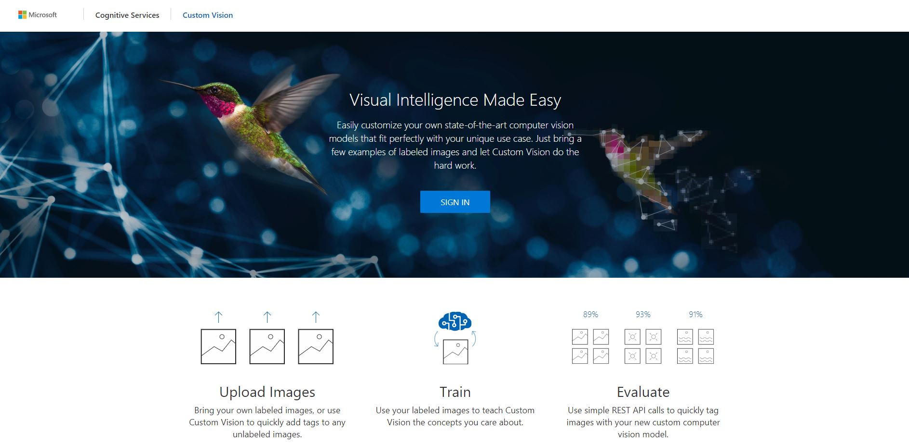

2. Please choose the **'Sign In'** button and enter your Azure account email address username and password

On the **'Stay signed in?'** page select **No**

> You will encounter a **permissions window**. This is making sure that you are happy for the Custom Vision website to access your Azure subscription. We will use this access to create a machine learning project instance.

> When you see this pop up please accept **Yes**

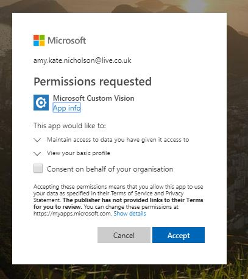

Then finally please accept the terms of service. Check the box and click the **I Agree** button

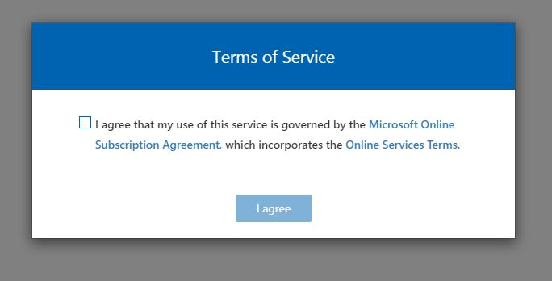

3. Now everything is setup you should land on a blank page with the **NEW PROJECT** box below. Select the **NEW PROJECT** button

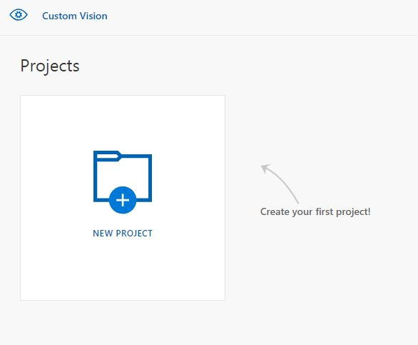

4. A **Create New Project** window should open. Enter the details below:
* Name: Hot Dog or Not
* Description: A classifier to understand if there are hot dogs in an image or other food

For the **Resource Group** box, we need to create a new one of these. Select the **create new** link.

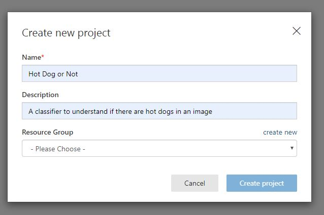

5. After clicking create new the **Create New Resource Group** window will open. Enter the details below:
* Name: application
* Azure Subscription: Choose the subscription you have setup today
* Location: West US 2
* Pricing Tier: SO

The select the **Create resource** button

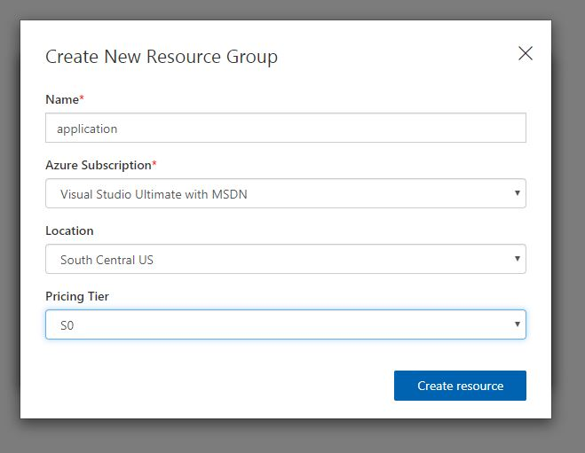

6. Once complete, you will return to the **Create new project** window and more options will appear. Select the details below:
* Project Types: Classification
* Classification Types: Multiclass (single tag per image)
* Domains: General

Then select the **Create project** button

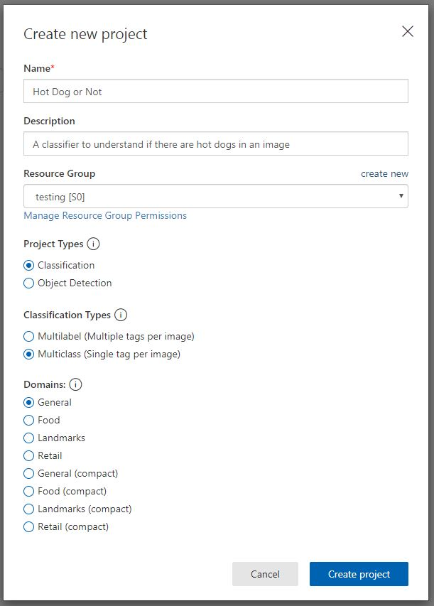

7. You will now see a blank project workspace as shown below. This is where we will create our Hot Dog or Not Hot Dog classifier.

8. Lets start to create our classifier by uploading some images for the machine to learn from.

Click the **add images** button in the top left

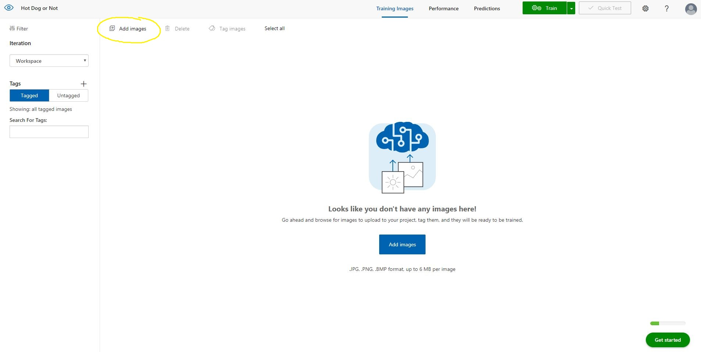

> On the workshop device the images are already provided. Please find these images in the My Documents Folder and confirm they are there.

> There is a folder containing 3 other folders:
* **hotdog:** this is a folder of 20 different images of hot dogs
* **nothotdog:** this is a folder of 20 different images of pizzas, hamburgers and spaghetti
* **test:** this is a folder of 13 images of hot dogs, pizza, hamburgers and spaghetti

Select the **hotdog** folder and select all the images in this folder. 

> Select all: Select the first image in the folder and hold CTRL + SHIFT and select the last image in the folder. All images should now be highlighted

Once all images are selected choose **open**

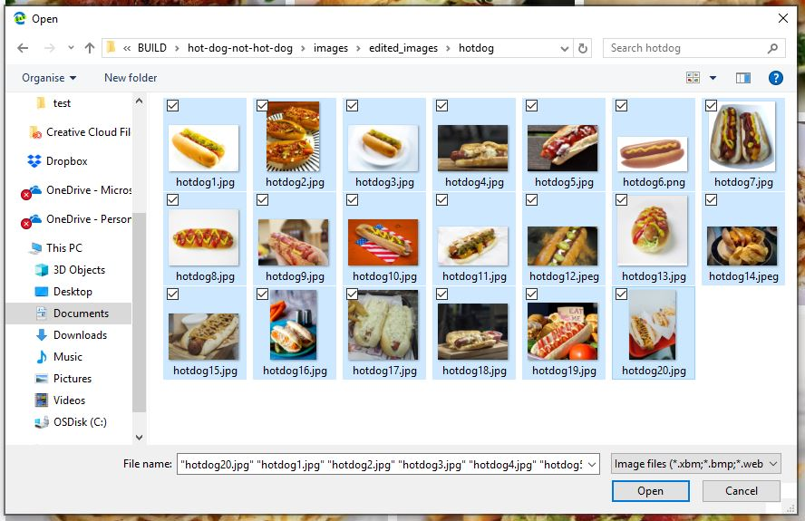

9. Now we need to let the computer know what is in these images. So add the tag **Hot Dog** in the bottom box and  select **Upload 20 files**

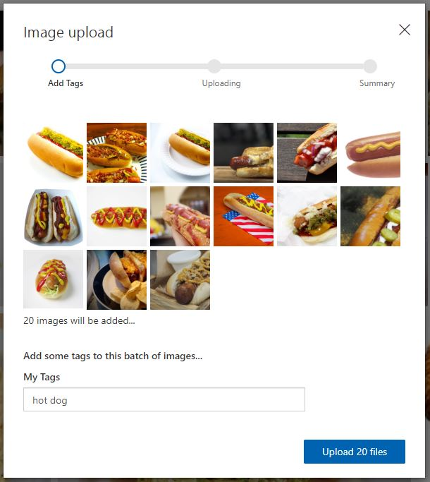

The uploading will take a couple of minutes. Wait for the progress bar to complete

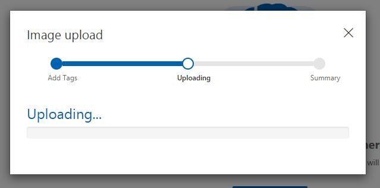

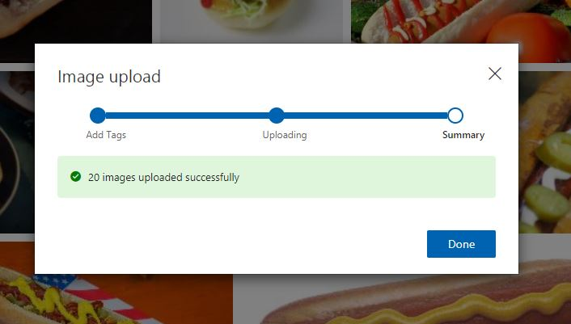

10. You should now see your Hot Dog images added to your workspace. Also note on the left of the screen you have a category called **hot dog** and the number of images uploaded (20)

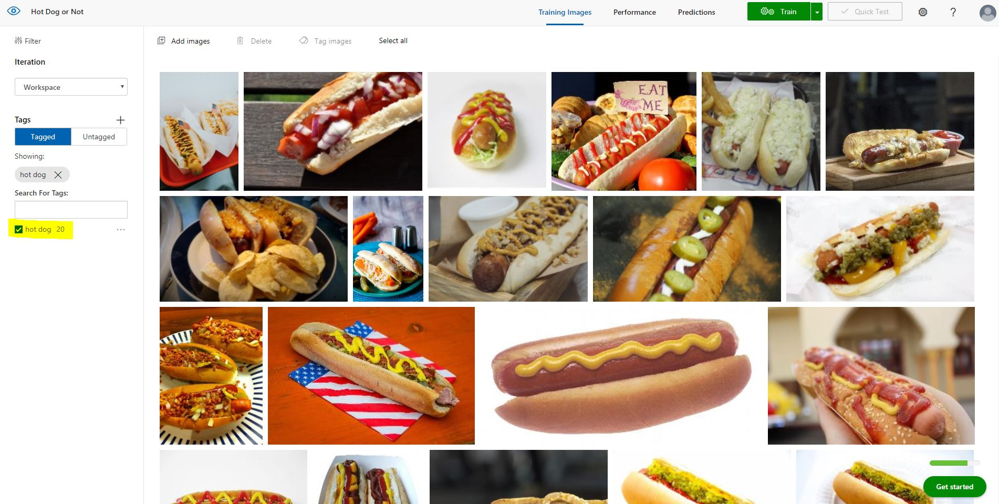

11. Now we will repeat this process but for our **Not Hot Dog** category. 

* Select Add images in the top left.
* Locate the **nothotdog** folder
* Select all 20 images in this folder (Hint: CTRL + SHIFT + select)
* Choose open

You will see your **not hot dog** images and now add the tag **not hot dog** and select upload

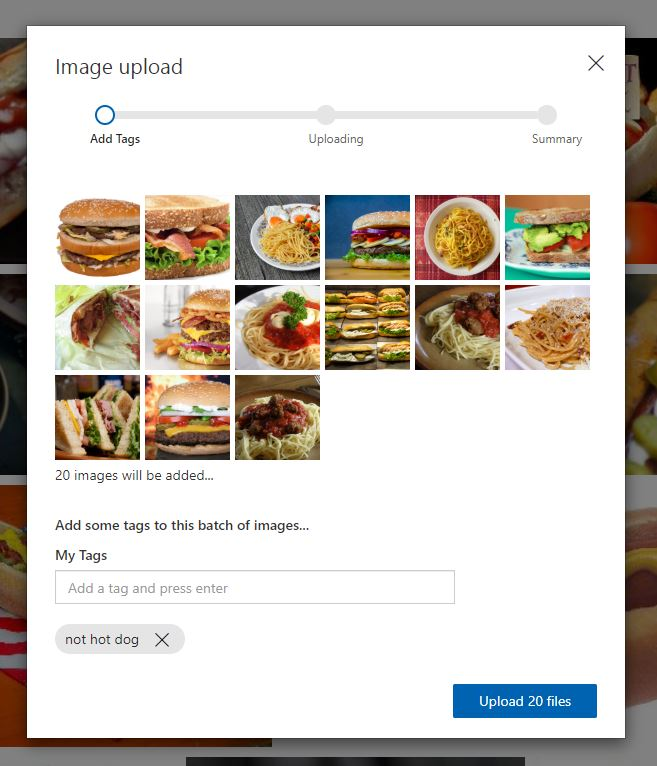

12. Now you will see both categories of images are uploaded

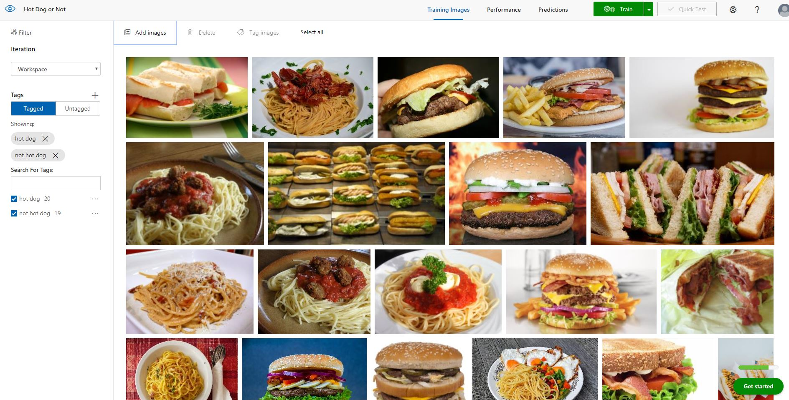

13. Lets teach the computer. Click the green **Train** button.

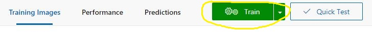

14. Within a couple of minutes you will be taken to the training performance page. Here you can review how effective the computer is at understanding whether there is a hot dog in the image.

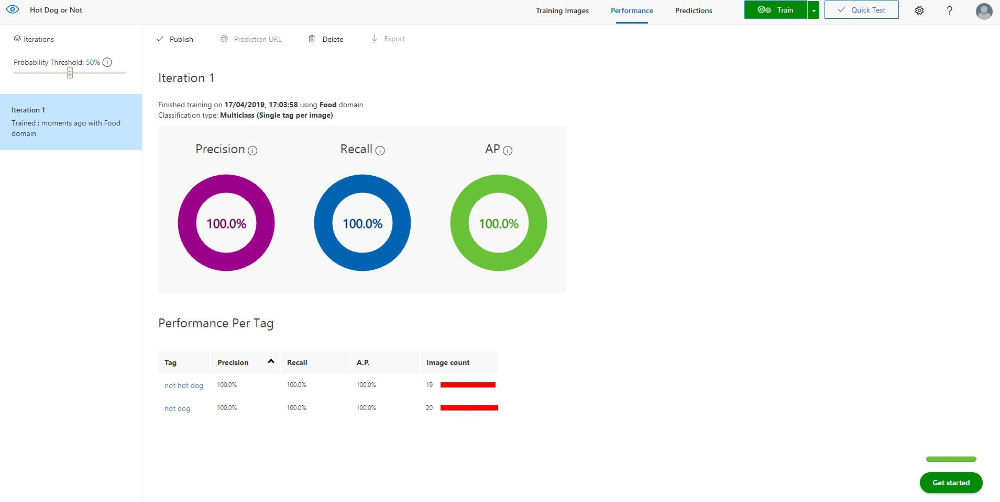

The closer to 100% on the metrics, means the classifier is very effective. At 87% this is very impressive after only uploading 40 images in total.

15. Ok, lets test the classifier using our own images. Choose the **Quick Test** button (hint: next to the train button)

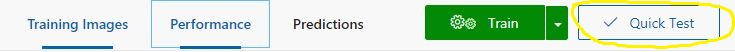

16. On the **Quick Test** page. Select the **Browse local files** button and navigate to the **test** folder of images you have not uploaded to the system.

Select an image of a hot dog and click open

The image will be uploaded and evaluated and results will be returned. Under the **Predictions** section. The category with the probability closest to 100% is the category the computer thinks is correct for this image.

**For example below:** the computer thinks this is a hot dog and its correct!

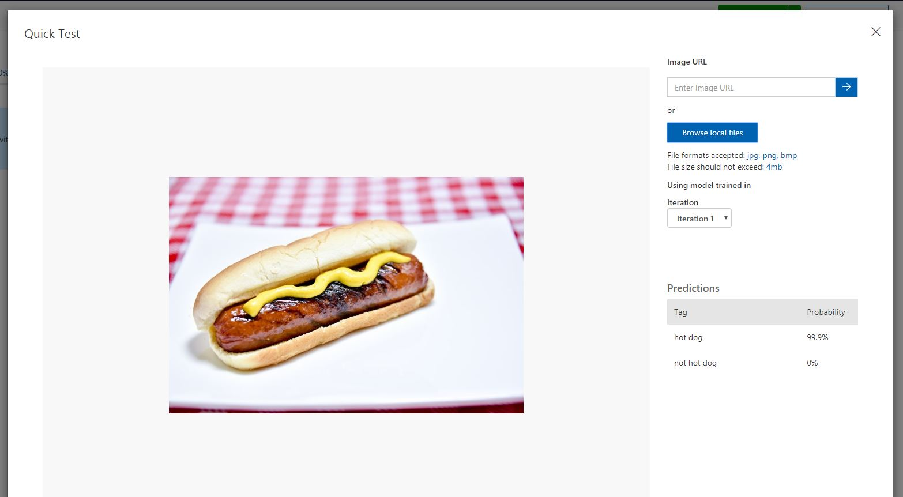

17. This time select **Browse local files** and pick a test image which is not a hot dog. What does the computer say is the correct category?

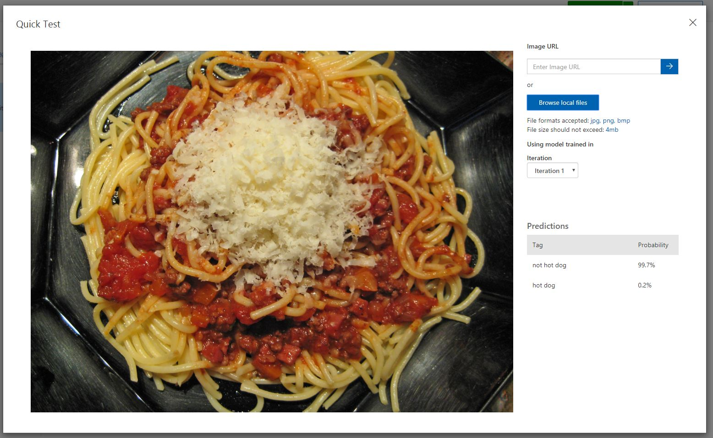

## Congratulations!!

You have built your own Hot Dog or Not Hot Dog machine learning classifier in 30 mins.

If you wish to continue building your machine learning algorithm into an application after the workshop

### Check out next steps and further instructions here: [NextSteps.md](https://github.com/amynic/build-hotdogapp/blob/master/NextSteps.md) 

